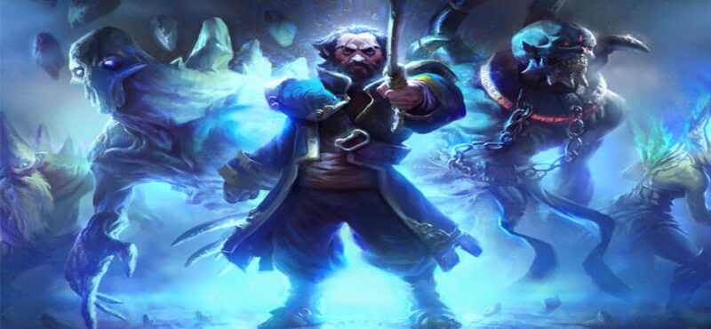
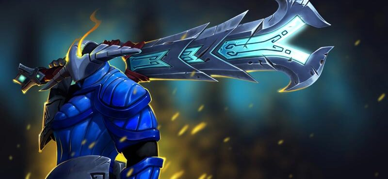
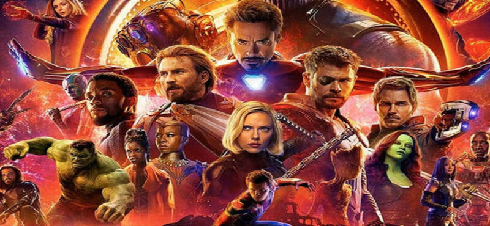
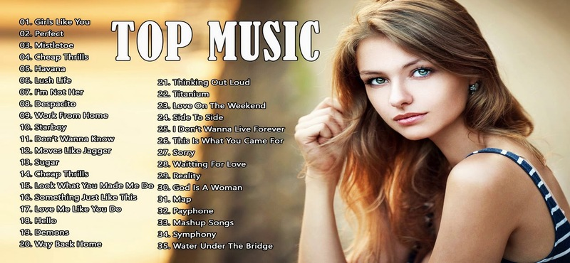

<!DOCTYPE html >
<head>
<title>Epic X</title>
<link href="style.css" rel="stylesheet" type="text/css" media="screen" />

</head>
<body>

	

		<ul>
			<li class="current_page_item"><a href="index.html">Home</a></li>
			<li><a href="game.html">Classic Games</a></li>
			<li><a href="place.html">Images Of Myanmar</a></li>
			<li><a href="movie.html">Movies</a></li>
			<li><a href="music.html">Music</a></li>
                        <li><a href="about.html">About </a></li>
		</ul>
	

<embed name="GoodEnough" src="bg_audio/index.ogg" loop="true" hidden="true" autostart="true"> 

	         

            

   			 
1/ 8

                         
                         
Classic Games

            

  

    
2 / 8

    
    
Classic Game

  

    
3 / 8

    
    
Places in Myanmar

  

    
4 / 8

    
    
Places In Myanmar

  

    
5 / 8

    
    
Movies

  

    
6 / 8

    
    
Movies

  

    
7 / 8

    
    
Music

  

    
8 / 8

    
    
Music

  

                             <a class="prev" onclick="plusSlides(-1)">&#10094;</a>
                              <a class="next" onclick="plusSlides(1)">&#10095;</a>
                                             

                                               

                                       

                                              
                                             
                                             
                                             
                                             
                                            
                                            
                                             
                                     

	

	

	      

		

			

				<h2 class="title"><a href="index.html"><b><i>Epic X - Entartainment group </i></b></a></h2>
                                           
                                           By Group 3 Team
				
&nbsp;

				

                                   <h2 class="title"><a href="game.html">The Classic Games   </a></h2>
                                    
2019By  Maungkham

					
The purpose of this project is to entertain everyone. When you have an internet connection,  
                                            you can access our page and play the games directly from the broswer without download needed.
                                            And study how this games are written with by click "View Source Code" below here, but you'll need the internet 
                                            connection.
                                            Please keep in touch with us if you want to play more classic games and study more. The games listed on the Classic Games were 
                                            downloaded and keeped in our project file, so we do not need internet connection while we're showing the project.
                
                                            Respect to all of the game resources. Aung Kham
                                         

					
<a href="game.html">Play The Games Here</a>&nbsp;&nbsp;&nbsp;&nbsp;|&nbsp;&nbsp;&nbsp;&nbsp;<a href="github.com/maungkham/">View Source codes</a>

				

			

			

				<h2 class="title"><a href="place.html">Places in Myanmar</a></h2>
				
May 10, 2011Posted by <a href="#">Someone</a>

				
&nbsp;

				

					
The purpose of this project is to entertain everyone. When you have an internet connection,  
                                            you can access our page and play the games directly from the broswer without download needed.
                                            And study how this games are written with by click "View Source Code" below here, but you'll need the internet 
                                            connection.
                                            Please keep in touch with us if you want to play more classic games and study more. The games listed on the Classic Games were 
                                            downloaded and keeped in our project file, so we do not need internet connection while we're showing the project.
                
                                            Respect to all of the game resources. Aung Kham
                                          

					
<a href="place.html">Read More</a>&nbsp;&nbsp;&nbsp;&nbsp;|&nbsp;&nbsp;&nbsp;&nbsp;<a href="...html">Comments</a>

				

			

			

				<h2 class="title"><a href="movie.html">Myanmar Captioned Movies </a></h2>
				
May 10, 2011Posted by <a href="#">Someone</a>

				
&nbsp;

				

					
The purpose of this project is to entertain everyone. When you have an internet connection,  
                                            you can access our page and play the games directly from the broswer without download needed.
                                            And study how this games are written with by click "View Source Code" below here, but you'll need the internet 
                                            connection.
                                            Please keep in touch with us if you want to play more classic games and study more. The games listed on the Classic Games were 
                                            downloaded and keeped in our project file, so we do not need internet connection while we're showing the project.
                
                                            Respect to all of the game resources. Aung Kham

					
<a href=".html">Read More</a>&nbsp;&nbsp;&nbsp;&nbsp;|&nbsp;&nbsp;&nbsp;&nbsp;<a href=".html">Comments</a>

				

			

                             

				<h2 class="title"><a href="music.html">Musics </a></h2>
				
May 10, 2011Posted by <a href="#">Someone</a>

				
&nbsp;

				

					
The purpose of this project is to entertain everyone. When you have an internet connection,  
                                            you can access our page and play the games directly from the broswer without download needed.
                                            And study how this games are written with by click "View Source Code" below here, but you'll need the internet 
                                            connection.
                                            Please keep in touch with us if you want to play more classic games and study more. The games listed on the Classic Games were 
                                            downloaded and keeped in our project file, so we do not need internet connection while we're showing the project.
                
                                            Respect to all of the game resources. Aung Kham

					
<a href=".html">Read More</a>&nbsp;&nbsp;&nbsp;&nbsp;|&nbsp;&nbsp;&nbsp;&nbsp;<a href=".html">Comments</a>

				

			

		
&nbsp;

		

		<!-- end #content -->
		

			<ul>
				<li>
					

					<form method="get" action="google.com.mm">
						

							<input type="text" name="s" id="search-text" value="" />
							<input type="submit" id="search-submit" value="" />
						

					</form>
					

					
&nbsp;

				</li>
				<li>
					<h2>Notic!</h2>
					
All the contant listed in below may be copyright or stored and download from some website. Please note that 
                                             this project is for education and thank all of the owners.

				</li>
				<li>
					<h2>The Classic Games</h2>
					<ul>
                                               <li><a href="game.html">Editor's Choice</a></li>
						<li><a href="G.Arcade.html">Arcade</a></li>
						<li><a href="G.Puzzle.html">Puzzle</a></li>
						<li><a href="G.Board.html">Board</a></li>
						<li><a href="G.Rpg.html">Rpg</a></li>						
                                                <li><a href="G.Others.html">Others</a></li>
					</ul>
				</li>
				<li>
					<h2>Images Of Myanmar</h2>
					<ul>
						<li><a href="#">Cities</a></li>
						<li><a href="#">Pagodas</a></li>
						<li><a href="#">Beaches</a></li>
						<li><a href="#">Mountains View</a></li>
						<li><a href="#">Waterfalls</a></li>
						<li><a href="#">Zoo and park</a></li>
                                                <li><a href="#">Universities</a></li>
						<li><a href="#">Popular Places</a></li>
					</ul>
				</li>
				<li>
					<h2>Movies</h2>
					<ul>
						<li><a href="#">New</a></li>
						<li><a href="#">Cartoon</a></li>
						<li><a href="#">Burmese</a></li>
						<li><a href="#">Funny</a></li>
						<li><a href="#">Dramma</a></li>
						<li><a href="#">Others</a></li>
					</ul>
				</li>
                                         <li>
					<h2>Musics</h2>
					<ul>
						<li><a href="#">New</a></li>
						<li><a href="#">Billions View</a></li>
						<li><a href="#">POP</a></li>
						<li><a href="#">Rock</a></li>
						<li><a href="#">DJ</a></li>
						<li><a href="#">Others</a></li>
					</ul>
				</li>
			</ul>
		

		<!-- end #sidebar -->
		
&nbsp;

	

	

	

	</body>
</html>
